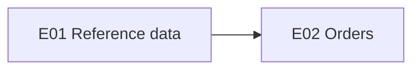

# <System> — Re-implementation backlog

Source specification: <spec dir / documents, level> · Generated: <YYYY-MM-DD> · Status: Draft for refinement

## Scope

- In scope: <epics / modules>
- Out of scope: <items + reason> (see [traceability.md](traceability.md#intentionally-out-of-scope))
- Gap / improvement stories: <included | excluded>

## Personas

| Persona | Description | Legacy role / permission | Evidence |
|---|---|---|---|

## Epics and features

| Epic | Goal | Features | Stories | Gap stories | Depends on |
|---|---|---|---|---|---|
| [E01 — <name>](epics/E01-<slug>.md) | | | | | |

## Epic dependencies

## Implementation order

Summary of waves — full list in [implementation-order.md](implementation-order.md).

| Wave | Stories | Theme |
|---|---|---|

## Coverage

| Spec item type | Total | Covered | Out of scope |
|---|---|---|---|
| Functional requirements | | | |
| API / web-service operations | | | |
| Entities | | | |
| I/O channels | | | |

## Open questions

| # | Question | Stories | Owner |
|---|---|---|---|
