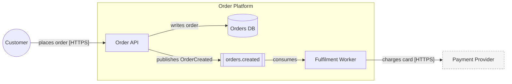

# Diagram notations

The brief lists which notations to produce. For each diagram:

| Notation | Where it goes |
|---|---|
| Mermaid | fenced ` ```mermaid ` block inside the `.md` document |
| PlantUML | fenced ` ```plantuml ` block inside the `.md` **and** a standalone `<doc>-<n>.puml` file next to it |
| draw.io | standalone `<doc>-<n>.drawio` file (one file, one page per diagram); the `.md` links to it |

When several notations are selected, all show the **same** elements and edges — generate the element list once, then render it per notation.

## Common conventions

- IDs: lowercase snake_case derived from the element name (`order_service`). Labels: human names.
- Every edge has a label: verb + data (`publishes OrderCreated`, `reads orders`). Include protocol in brackets at Standard/Deep (`[HTTPS/JSON]`, `[Kafka]`, `[JDBC]`).
- Element kinds and shapes (keep consistent across notations):

| Kind | Mermaid flowchart | PlantUML | draw.io style |
|---|---|---|---|
| Person / actor | `id(("Label"))` | `actor` / `Person()` | `shape=umlActor` |
| The system / container / process | `id["Label"]` | `rectangle` / `Container()` | `rounded=1` fill `#dae8fc` |
| External system | `id["Label"]:::ext` | `System_Ext()` | `rounded=1;dashed=1` fill `#f5f5f5` |
| Data store / DB | `id[("Label")]` | `database` / `ContainerDb()` | `shape=cylinder3` fill `#d5e8d4` |
| Queue / topic | `id[["Label"]]` | `queue` / `ContainerQueue()` | `shape=mxgraph.aws4.queue` or `shape=process` fill `#fff2cc` |
| File / document | `id[/"Label"/]` | `file` | `shape=note` fill `#ffe6cc` |

- Max ~25 nodes per diagram; split by subsystem if larger (link diagrams by name).
- Keep a legend when using more than 3 element kinds (Mermaid: a small subgraph; PlantUML: `legend`; draw.io: text box).

## Mermaid

Flowchart (block / data-flow):


C4 (optional, when the user prefers C4 syntax): `C4Context`, `C4Container`, `C4Component` with `Person()`, `System()`, `System_Ext()`, `Container()`, `ContainerDb()`, `Rel()`. Mermaid C4 is experimental — if unsure, use flowchart with subgraphs as system boundaries.

Sequence: `sequenceDiagram`, `autonumber`, `participant`/`actor`, `->>` sync, `-)` async, `-->>` reply, `alt/else/opt/loop/par` blocks, `Note over`.

ERD: `erDiagram`, `ENTITY { type name PK "comment" }`, relations `||--o{`, `}o--o{`, `||--||`.

Rules: quote labels containing spaces/special characters; no `end` as a bare node id; avoid parentheses in unquoted labels.

## PlantUML

- Block diagrams: C4-PlantUML
  ```plantuml
  @startuml
  !include https://raw.githubusercontent.com/plantuml-stdlib/C4-PlantUML/master/C4_Container.puml
  Person(customer, "Customer")
  System_Boundary(sys, "Order Platform") {
    Container(api, "Order API", "Python/FastAPI")
    ContainerDb(db, "Orders DB", "PostgreSQL")
    ContainerQueue(topic, "orders.created", "Kafka")
  }
  System_Ext(pay, "Payment Provider")
  Rel(customer, api, "places order", "HTTPS")
  Rel(api, db, "writes order", "SQL")
  Rel(api, topic, "publishes OrderCreated")
  @enduml
  ```
  If the environment is offline, mention that `!include <C4/C4_Container>` (stdlib form) works with a local PlantUML jar.
- Data flow: plain PlantUML component/deployment elements (`actor`, `rectangle`, `database`, `queue`, `file`) with labelled arrows `-->`.
- Sequence: `@startuml` … `autonumber`, `actor`, `participant`, `database`, `queue`, `alt/else/end`, `group`, `->` sync, `->>` async, `-->` return.
- ERD: `entity Order { * id : uuid <<PK>> -- customer_id : uuid <<FK>> }`, relations `||--o{`.

## draw.io

- Start from `../templates/drawio-skeleton.drawio`. One `<diagram name="...">` per diagram; inside, `mxGraphModel/root` with cells `0` and `1` (parent) then your cells.
- Vertex: `<mxCell id="api" value="Order API" style="rounded=1;whiteSpace=wrap;html=1;fillColor=#dae8fc;strokeColor=#6c8ebf;" vertex="1" parent="1"><mxGeometry x="200" y="120" width="160" height="60" as="geometry"/></mxCell>`
- Edge: `<mxCell id="e1" value="publishes OrderCreated" style="edgeStyle=orthogonalEdgeStyle;rounded=0;html=1;endArrow=block;" edge="1" parent="1" source="api" target="topic"><mxGeometry relative="1" as="geometry"/></mxCell>`
- Container/boundary: a vertex with `style="swimlane;..."` or `container=1`; children use `parent="<boundary id>"` with coordinates relative to it.
- Layout: left-to-right in columns — actors (x≈40) → system components (x≈260…) → stores/queues → external systems (rightmost). Row spacing ~110 px, column spacing ~220 px. Avoid overlaps; compute positions from column/row indices.
- Escape XML in labels (`&amp;`, `&lt;`, `&quot;`). Use `&#xa;` for line breaks inside `value`.
- Validate: the file must be well-formed XML (if Python is available: `python3 -c "import xml.etree.ElementTree as E; E.parse('<file>')"`).
